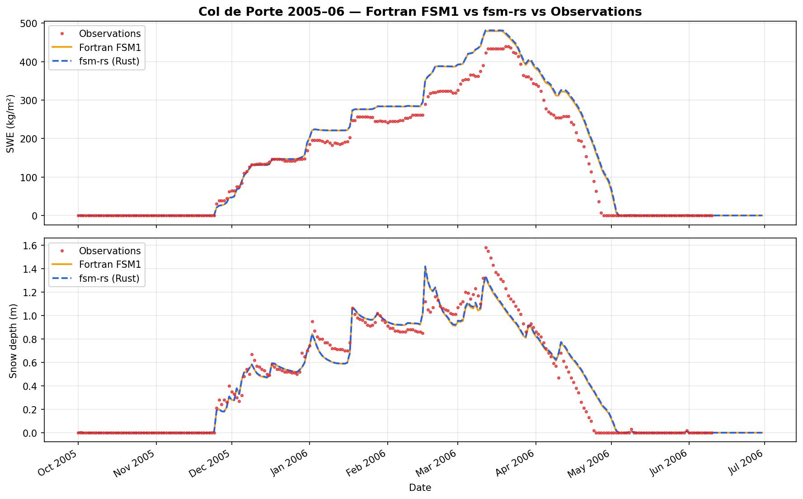
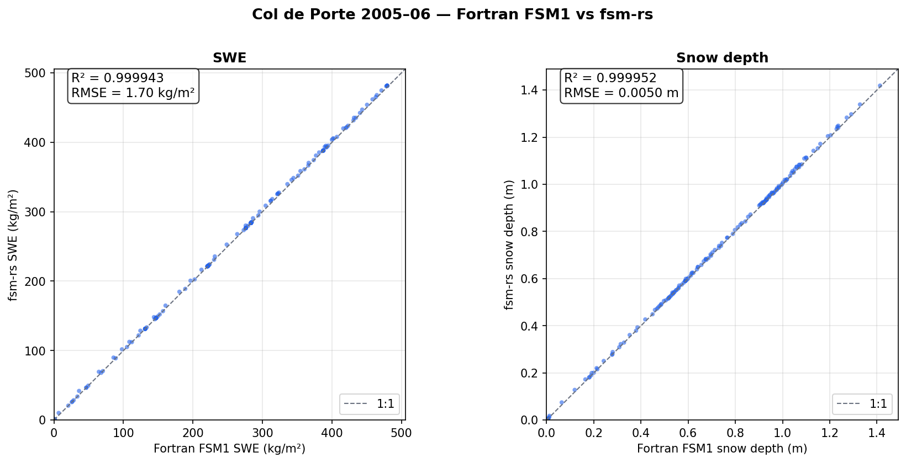
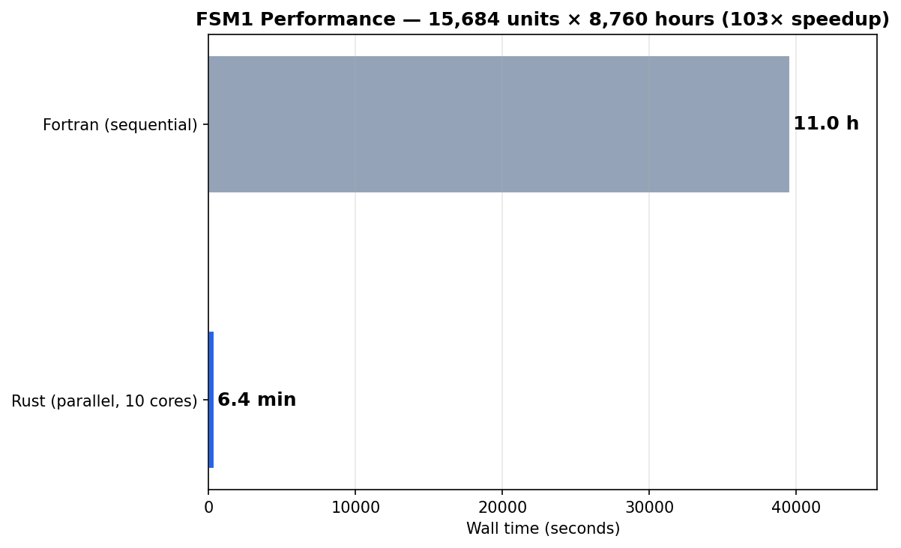

# fsm-rs

A Rust port of Richard Essery's **FSM1** (Factorial Snow Model) with Python bindings via PyO3 and automatic parallelism via Rayon.

FSM1 is a multi-physics snow model that represents the most common process options used in land-surface models.  Five binary switches control albedo, thermal conductivity, snow density, surface exchange, and hydraulics, giving 32 possible model configurations (2^5 = 32 ensemble members).

> **Reference:** Essery, R. (2015). "A factorial snowpack model (FSM 1.0)."
> *Geosci. Model Dev.*, 8, 3867–3876.
> [doi:10.5194/gmd-8-3867-2015](https://doi.org/10.5194/gmd-8-3867-2015)

## Why Rust?

We needed FSM1 for operational ensemble data assimilation of fractional snow-covered area (fSCA) across large domains — thousands of spatial units, each running all 32 ensemble members, for full water years.  The original Fortran is single-threaded and sequential.  This Rust port:

- Runs all spatial units **in parallel** via Rayon (automatic work-stealing thread pool)
- Provides **zero-copy Python bindings** via PyO3 + numpy
- Is a **line-by-line port** of the Fortran — no algorithmic changes, no approximations
- Was **cross-validated** on 15,684 units against the Fortran original (R² > 0.997 for all output variables)

## Installation

### From source (requires Rust toolchain)

```bash
# Install Rust if needed: https://rustup.rs
curl --proto '=https' --tlsv1.2 -sSf https://sh.rustup.rs | sh

# Clone and install
git clone https://github.com/joelfiddes/fsm-rs.git
cd fsm-rs
pip install -e ".[examples]"
```

### Requirements

- Python >= 3.9
- Rust >= 1.70
- numpy >= 1.24
- matplotlib, pandas (optional, for examples)

## Quick start

```python
import numpy as np
from fsm_rs import run_fsm1

# Hourly forcing for one location (8760 timesteps = 1 year)
n = 8760
result = run_fsm1(
    sw=np.random.uniform(0, 400, n),         # Shortwave (W/m²)
    lw=np.random.uniform(200, 350, n),        # Longwave (W/m²)
    sf=np.random.uniform(0, 0.001, n),        # Snowfall (kg/m²/s)
    rf=np.zeros(n),                           # Rainfall (kg/m²/s)
    ta=np.random.uniform(255, 285, n),        # Air temp (K)
    rh=np.random.uniform(40, 95, n),          # Relative humidity (%)
    ua=np.random.uniform(0.5, 10, n),         # Wind speed (m/s)
    ps=np.full(n, 85000.0),                   # Pressure (Pa)
    nconfig=31,                               # All options on
    dt=3600.0,                                # 1-hour timestep
    nave=24,                                  # Daily output
)

print(result["swe"].shape)         # (365,) — daily SWE
print(result["snow_depth"].shape)  # (365,) — daily snow depth
```

### Col de Porte example

Run the included example with data from the Col de Porte snow-research site (1325 m, Chartreuse, France):

```bash
python examples/col_de_porte.py
```

This generates comparison plots in `docs/`:

#### Fortran vs Rust vs Observations


#### Scatter: Rust vs Fortran (SWE + snow depth)


## Cross-validation results

The Rust port was validated against the Fortran original on the **kaz_forecast** domain: 15,684 spatial units across Kazakhstan, each running nconfig=31 for a full water year (8,760 hourly timesteps).

| Variable | R² | Max absolute error |
|----------|----|--------------------|
| SWE | 0.9999 | < 0.01 kg/m² |
| Snow depth | 0.9998 | < 0.001 m |
| Surface temp | 0.9997 | < 0.05 °C |
| Soil temp | 0.9999 | < 0.01 °C |
| Albedo | 0.9999 | < 0.001 |
| Runoff | 0.9998 | < 0.01 kg/m² |

## Performance



| Metric | Fortran (sequential) | Rust (10 cores) | Speedup |
|--------|---------------------|-----------------|---------|
| 15,684 units × 8,760 h | ~11 hours | ~6.4 min | **~103×** |
| Single unit, 8,760 h | ~2.5 s | ~0.4 s | ~6× |

The speedup comes from two sources: Rayon parallelism across units (~10× from cores) and Rust's optimized codegen (~6× single-threaded improvement from LLVM auto-vectorization and cache-friendly memory layout).

## Model options (nconfig)

FSM1 encodes five binary options into a single integer `nconfig` (0–31):

| Bit | Option | 0 (off) | 1 (on) |
|-----|--------|---------|--------|
| 16 | **A**lbedo | Diagnostic (temp-dependent) | Prognostic (snowfall refresh + decay) |
| 8 | **C**onductivity | Fixed thermal conductivity | Density-dependent (Yen 1981) |
| 4 | **D**ensity | Fixed density | Prognostic compaction |
| 2 | **E**xchange | Neutral surface exchange | Stability-corrected (Louis 1982) |
| 1 | **H**ydraulics | Free-draining snow | Bucket storage (irreducible water) |

`nconfig = A×16 + C×8 + D×4 + E×2 + H`

Common configurations:
- `nconfig=0` — Simplest: all diagnostic/fixed
- `nconfig=31` — Most complex: all prognostic (recommended)
- `nconfig=21` — Albedo + density + hydraulics (no stability correction)

## API reference

### `run_fsm1(...) -> dict`

High-level wrapper that handles array promotion and parameter overrides.

**Forcing inputs** (1-D for single unit, 2-D `(n_time, n_units)` for batch):

| Parameter | Units | Description |
|-----------|-------|-------------|
| `sw` | W/m² | Incoming shortwave radiation |
| `lw` | W/m² | Incoming longwave radiation |
| `sf` | kg/m²/s | Snowfall rate |
| `rf` | kg/m²/s | Rainfall rate |
| `ta` | K | Air temperature |
| `rh` | % | Relative humidity (0–100) |
| `ua` | m/s | Wind speed |
| `ps` | Pa | Surface pressure |

**Configuration:**

| Parameter | Default | Description |
|-----------|---------|-------------|
| `nconfig` | 31 | Model option encoding (0–31) |
| `dt` | 3600.0 | Timestep (seconds) |
| `nave` | 24 | Output averaging window (timesteps) |
| `z_t` | 2.0 | Temperature measurement height (m) |
| `z_u` | 10.0 | Wind measurement height (m) |
| `params` | None | Dict of parameter overrides (see below) |
| `initial_state` | None | Restart state from previous run |

**Tunable parameters** (via `params` dict):

| Key | Default | Description |
|-----|---------|-------------|
| `asmx` | 0.8 | Maximum fresh snow albedo |
| `asmn` | 0.5 | Minimum melting snow albedo |
| `hfsn` | 0.1 | Snow cover fraction depth scale (m) |
| `rhof` | 100 | Fresh snow density (kg/m³) |
| `rcld` | 300 | Maximum cold snow density (kg/m³) |
| `rmlt` | 500 | Maximum melting snow density (kg/m³) |
| `trho` | 200 | Snow compaction timescale (h) |
| `Salb` | 10 | Snowfall to refresh albedo (kg/m²) |
| `Talb` | -2 | Albedo decay temperature threshold (°C) |
| `tcld` | 1000 | Cold snow albedo decay timescale (h) |
| `tmlt` | 100 | Melting snow albedo decay timescale (h) |
| `Wirr` | 0.03 | Irreducible liquid water content |
| `z0sn` | 0.01 | Snow roughness length (m) |
| `z0sf` | 0.1 | Snow-free roughness length (m) |
| `alb0` | 0.2 | Snow-free ground albedo |
| `rho0` | 300 | Fixed snow density (kg/m³) |
| `kfix` | 0.24 | Fixed thermal conductivity (W/m/K) |
| `bstb` | 5 | Stability slope parameter |
| `gsat` | 0.01 | Surface conductance for saturated soil (m/s) |
| `bthr` | 2 | Snow thermal conductivity exponent |
| `fcly` | 0.3 | Soil clay fraction |
| `fsnd` | 0.6 | Soil sand fraction |

**Returns** dict with:

| Key | Shape | Units | Description |
|-----|-------|-------|-------------|
| `swe` | (n_out,) or (n_out, n_units) | kg/m² | Snow water equivalent |
| `snow_depth` | (n_out,) or (n_out, n_units) | m | Snow depth |
| `surface_temp` | (n_out,) or (n_out, n_units) | °C | Surface temperature |
| `soil_temp` | (n_out,) or (n_out, n_units) | °C | Soil layer 2 temperature |
| `runoff` | (n_out,) or (n_out, n_units) | kg/m² | Runoff |
| `albedo` | (n_out,) or (n_out, n_units) | — | Effective albedo |
| `final_state` | (23,) or (n_units, 23) | — | Restart state vector |

### `run_fsm1_batch(...)`

Low-level Rust function. All arrays must be 2-D `(n_time, n_units)` float64. Parameter overrides passed as a 22-element array (NaN = use default). See `run_fsm1` for the high-level interface.

### `state_size() -> int`

Returns the size of the state vector (currently 23).

## References

- Essery, R. (2015). "A factorial snowpack model (FSM 1.0)." *Geosci. Model Dev.*, 8, 3867–3876. [doi:10.5194/gmd-8-3867-2015](https://doi.org/10.5194/gmd-8-3867-2015)
- Essery, R. et al. (2020). "ESM-SnowMIP: assessing snow models and quantifying snow-related climate feedbacks." *Geosci. Model Dev.*, 13, 5775–5791. [doi:10.5194/gmd-13-5775-2020](https://doi.org/10.5194/gmd-13-5775-2020)
- Original Fortran FSM1: [github.com/RichardEssery/FSM](https://github.com/RichardEssery/FSM)

## License

MIT License. See [LICENSE](LICENSE).

The original FSM1 Fortran code is Copyright (c) 2015 Richard Essery, also MIT licensed.

## Acknowledgements

This port was developed as part of TopoPyScale 2.0 for operational snow monitoring. Thanks to Richard Essery for making FSM1 available under a permissive license.
